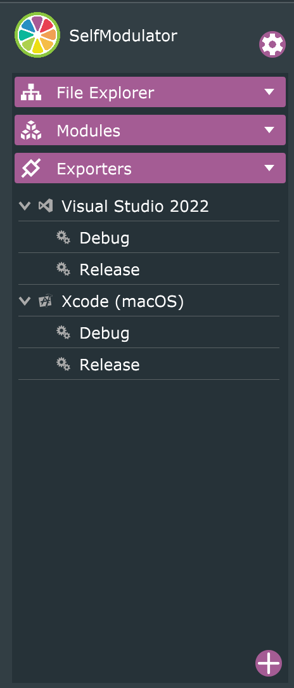

# SelfModulator
SelfModulator is a VST3 audio plugin that implements Figure 5. in this paper: https://www.music.mcgill.ca/~ich/research/misc/papers/cr1154.pdf

## Build Instructions
1) Download Projucer at https://juce.com/get-juce/
2) Open SelfModulator.jucer
3) Select exporter at the top (Visual Studio for Windows, Xcode for Mac). 
    

    More export targets can be added in the "Exporters" panel with the "+" button.
    

4) Build the project in your IDE!

## Installation Instructions
1) 